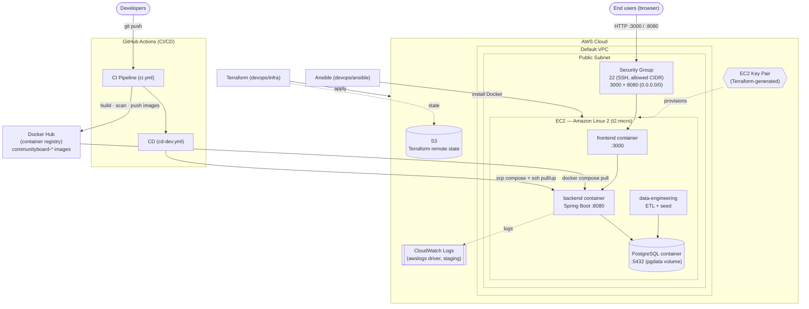
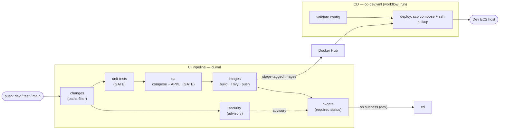

# Infrastructure Architecture — CommunityBoard

This page documents the deployed topology on **AWS** and the **CI/CD pipeline**
that puts code there. Two renderings are provided:

- a **Mermaid diagram** below — renders natively on GitHub, no tooling needed;
- an **official-AWS-icon chart** generated from
  [`devops/diagrams/architecture.py`](devops/diagrams/architecture.py) (the
  "AWS standard" chart) — see [§3](#3-official-aws-icon-diagram) to render it.

See [DEPLOYMENT.md](DEPLOYMENT.md) for prerequisites, env vars, and step-by-step
deploy/provisioning instructions.

---

## 1. AWS infrastructure (runtime topology)

A single application EC2 host runs the whole stack via Docker Compose. Images are
pulled from Docker Hub; Terraform provisions the AWS resources and stores its
state in S3; the staging stack ships container logs to CloudWatch Logs.



### Resources Terraform creates (`devops/infra/main.tf`)
| AWS resource | Detail |
|--------------|--------|
| `aws_instance.app` | Amazon Linux 2, `t2.micro` (default), public IP, in the default subnet |
| `aws_security_group.app` + rules | ingress 22 (`allowed_ssh_cidr`), 3000 & 8080 (`0.0.0.0/0`); egress all |
| `aws_key_pair.deployer` (+ `tls_private_key`) | RSA 4096 key, private key written locally for Ansible |
| `data.aws_vpc.default` / `data.aws_subnets.default` | uses the account's default networking |
| `data.aws_ami.amazon_linux` | latest `amzn2-ami-hvm-*-x86_64-gp2` |
| S3 backend (`backend "s3"`) | remote Terraform state (bootstrapped separately) |
| CloudWatch Logs | via the compose `awslogs` log driver in staging (`AWS_REGION`, group `test`) |

Region: `us-west-1` (default, configurable); staging logs default to `eu-west-1`.

---

## 2. CI/CD pipeline (delivery flow)



**Tags by branch:** `dev → :dev` · `test → :test-latest` · `main → :<sha> + :latest`.
Full design rationale is in [DEPLOYMENT.md §5](DEPLOYMENT.md#5-cicd-pipeline-design)
and [devops/ci/README.md](devops/ci/README.md).

---

## 3. Official-AWS-icon diagram

For an "AWS standard chart" using the official AWS component icons, render
[`devops/diagrams/architecture.py`](devops/diagrams/architecture.py) with the
[`diagrams`](https://diagrams.mingrammer.com/) library:

```bash
# Requires Graphviz (`brew install graphviz` / `apt-get install graphviz`)
cd devops/diagrams
python3 -m venv .venv && source .venv/bin/activate
pip install -r requirements.txt
python architecture.py          # writes communityboard-aws-architecture.png
```

The script emits `communityboard-aws-architecture.png` using AWS service icons
(EC2, VPC, Security Group, S3, CloudWatch, ECR-style registry, etc.). Commit the
PNG alongside this doc if you want it to render inline on GitHub.
